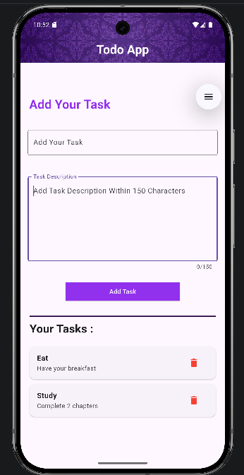

# Todo App

A simple and clean **Todo application built with Flutter**.

This project was created as a Flutter practice project to understand core Flutter concepts such as:

- `StatefulWidget`
- `setState()`
- `TextEditingController`
- `dispose()`
- `Map<String, String>`
- Dynamic UI rendering
- Adding and deleting items
- Flutter layouts and Material widgets
- App launcher icon configuration

---

## Screenshot

<p align="center">
  
</p>

---

## Features

### Add Tasks

Users can enter:

- Task name
- Task description

and add the task to the list.

Each task is stored as a key-value pair in a Dart `Map`.

Example:

```dart
Map<String, String> tasks = {
  "Learn Dart": "Study Maps and Lists",
  "Workout": "Chest and triceps",
};
```

The task name is the **key**, while the description is the **value**.

### Display Tasks

The application dynamically displays all tasks stored in the map.

The UI is rebuilt using:

```dart
setState(() {
  tasks[taskName] = description;
});
```

### Delete Tasks

Each task has a delete button.

When the button is pressed:

```dart
tasks.remove(taskName);
```

removes the task from the map and `setState()` rebuilds the interface.

### Text Controllers

The application uses two `TextEditingController` objects:

```dart
TextEditingController name = TextEditingController();
TextEditingController desc = TextEditingController();
```

They are connected to the two text fields and allow the application to read and clear user input.

### Proper Controller Disposal

The controllers are disposed of when the widget is removed:

```dart
@override
void dispose() {
  name.dispose();
  desc.dispose();
  super.dispose();
}
```

This prevents the controllers from unnecessarily remaining in memory after the widget is destroyed.

---

## Tech Stack

| Technology | Purpose |
|---|---|
| Flutter | Application framework |
| Dart | Programming language |
| Material UI | User interface components |
| `TextEditingController` | Reading text-field input |
| `Map<String, String>` | In-memory task storage |
| `setState()` | Updating the UI |

---

## Project Structure

A simplified project structure looks like:

```text
todo_app/
│
├── android/
├── ios/
├── lib/
│   └── main.dart
│
├── assets/
│   ├── images/
│   │   └── bg.avif
│   │
│   └── icon/
│       └── app_icon.png
│
├── test/
│
├── pubspec.yaml
└── README.md
```

---

## How It Works

The application follows a simple flow:

```text
User enters task
       ↓
TextEditingController reads input
       ↓
addTask() is called
       ↓
Task is added to Map
       ↓
setState() is called
       ↓
Flutter rebuilds the UI
       ↓
Task appears on screen
```

For deletion:

```text
User presses delete
       ↓
deleteTask() is called
       ↓
Task is removed from Map
       ↓
setState() is called
       ↓
Flutter rebuilds the UI
       ↓
Task disappears
```

---

## Data Structure

Tasks are stored using:

```dart
Map<String, String> tasks = {};
```

The structure is:

```text
Key                  Value
-----------------------------------
"Learn Dart"         "Study Maps"
"Workout"            "Chest and triceps"
"Read Book"          "Read 20 pages"
```

This makes the task name unique because a `Map` cannot contain two identical keys.

For example:

```dart
tasks["Learn Dart"] = "Study Maps";
```

If `"Learn Dart"` already exists, its description will be replaced.

---

## Important Flutter Concepts Practiced

### StatefulWidget

The app uses a `StatefulWidget` because the task list changes while the application is running.

```dart
class TodoApp extends StatefulWidget {
  const TodoApp({super.key});

  @override
  State<TodoApp> createState() => _AppDesign();
}
```

### setState()

Whenever the task data changes:

```dart
setState(() {
  tasks[taskName] = description;
});
```

Flutter knows that the UI needs to be rebuilt.

Without `setState()`, changing the map would not automatically cause the visible UI to update.

### TextEditingController

Controllers provide access to the text entered into the `TextField`.

```dart
String taskName = name.text;
String description = desc.text;
```

They are also used to clear the fields:

```dart
name.clear();
desc.clear();
```

### dispose()

Controllers consume resources. They should be disposed of when the State object is removed:

```dart
@override
void dispose() {
  name.dispose();
  desc.dispose();
  super.dispose();
}
```

---

## Running the Project

### Prerequisites

Install:

- Flutter SDK
- Dart SDK (included with Flutter)
- Android Studio or VS Code
- Android emulator or physical Android device

Verify Flutter:

```bash
flutter doctor
```

---

### Clone the Project

```bash
git clone <YOUR_GITHUB_REPOSITORY_URL>
```

Move into the project:

```bash
cd todo_app
```

Install dependencies:

```bash
flutter pub get
```

Run the application:

```bash
flutter run
```

---

## Running on a Physical Android Device

Enable **Developer Options** and **USB Debugging** on your Android phone.

Connect the phone to your computer and check:

```bash
flutter devices
```

Then run:

```bash
flutter run
```

Flutter will install and launch the application on the connected device.

---

## Building an APK

To create a release APK:

```bash
flutter build apk --release
```

The APK will be generated at:

```text
build/app/outputs/flutter-apk/app-release.apk
```

You can transfer this APK to an Android phone and install it.

---

## App Icon

The project uses `flutter_launcher_icons` to generate the application launcher icon.

The package is configured in `pubspec.yaml`:

```yaml
dev_dependencies:
  flutter_launcher_icons: ^0.14.4

flutter_launcher_icons:
  android: true
  ios: true
  image_path: "assets/icon/app_icon.png"
```

Generate the icons with:

```bash
dart run flutter_launcher_icons
```

---

## Current Limitations

This version intentionally uses an in-memory Dart `Map` rather than a backend or local database.

That means:

> **Tasks disappear when the application is completely restarted.**

The current architecture is:

```text
Flutter UI
    ↓
Dart Map
    ↓
UI
```

There is currently no:

- FastAPI backend
- MongoDB database
- User authentication
- Cloud synchronization
- Local persistent storage

This keeps the project simple and focused on learning Flutter fundamentals.

---

## Possible Future Improvements

The project can later be expanded with:

- Persistent local storage using Hive or SQLite
- FastAPI backend
- MongoDB
- User authentication
- Task completion status
- Task editing
- Task priorities
- Due dates
- Categories
- Search and filtering
- Dark mode
- Notifications
- Cloud synchronization

A future backend architecture could look like:

```text
Flutter App
     ↓
REST API
     ↓
FastAPI
     ↓
MongoDB
```

---

## Learning Goals

This project was mainly built to practice the fundamentals behind interactive Flutter applications rather than simply following a UI tutorial.

The main concepts practiced are:

1. Creating a `StatefulWidget`
2. Managing mutable state
3. Reading user input
4. Using `TextEditingController`
5. Understanding `setState()`
6. Working with Dart `Map`
7. Dynamically generating widgets
8. Handling button actions
9. Removing data from a collection
10. Properly disposing controllers
11. Managing Flutter assets
12. Building an Android APK

---

## License

This project is intended primarily as a learning and practice project.

You are free to modify the code and use it as a foundation for your own Flutter projects.
